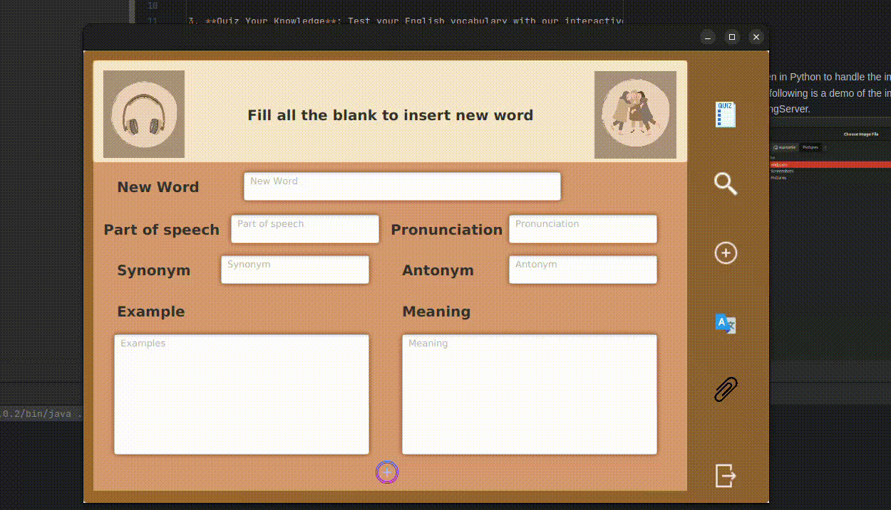
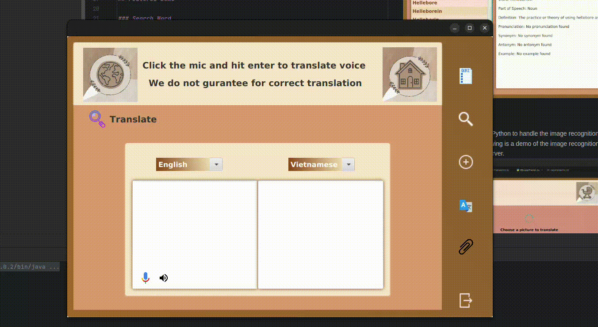
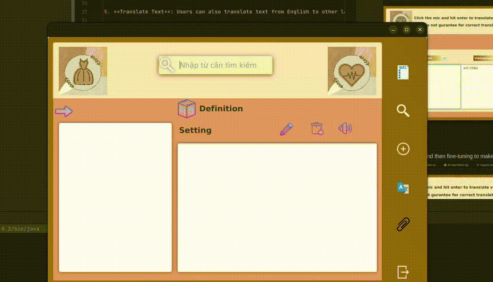

# Dictionary Project Readme

## Overview

Welcome to our Dictionary Project! This is a user-friendly and feature-rich application that allows users to explore the English language in various ways. The project offers the following key functionalities:

1. **Search Word**: Users can look up the meanings, definitions, and example usages of words. The search feature provides comprehensive and accurate results.

2. **Listen to Word**: The application includes a pronunciation feature that allows users to listen to the correct pronunciation of a word. This helps improve language skills and understanding.

3. **Quiz Your Knowledge**: Test your English vocabulary with our interactive quiz feature. The quiz presents users with random word definitions, and they can attempt to match them with the correct words.

4. **Translate Image**: Our advanced image recognition system can translate text found in images. Simply upload an image with English text, and the application will provide the corresponding translation.

5. **Translate Text**: Users can also translate text from English to other languages. The application supports over 100 languages, including Spanish, French, German, and Chinese.

6. **Translate Voice**: The application can also translate voice recordings. Users can record their voice and the application will provide the corresponding translation.

## Features Demo

### Search Word
You can also click the speaker icon to hear the pronunciation of the word. The rubbish bin icon will delete the word from the dictionary.
The pen icon will allow you to edit the word.

### Adding Word
If the word is already in the dictionary, it will be updated. Otherwise, it will be added to the dictionary.

### Translate Image
We use a Flask Server written in Python to handle the image recognition and translation. The server is hosted locally. The following is a demo of the image recognition and translation feature.
This is located in AIProcessingServer.

### Translate Full Text to 4 Languages
We use the Google Translate API to translate the text. The following is a demo of the text translation feature. You can translate the word back and forth between English, Spanish, French, Vietnames.

### Translate Voice
We use the Whisper Model and then fine-tuning to make it faster. We use model type Base.en.

### Quizzing Your Knowledge

